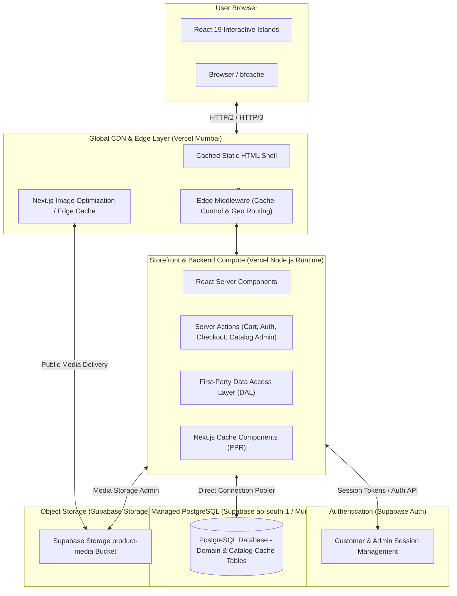

# Architecture & Delivery Topology

## 1. System Topology Overview

---

## 2. Architecture Tiers & Environments

To ensure benchmark integrity and avoid contaminated comparisons, this repository strictly distinguishes between architecture environments:

### Tier 1: Active Production Architecture (Current Live Baseline)
* **Storefront & Backend**: Next.js 16 (React 19) hosted on **Vercel** ([`mirzafootwear.vercel.app`](https://mirzafootwear.vercel.app)). Static shells and catalog routes are cached at edge nodes (Mumbai `bom1`). Direct first-party Server Actions and Data Access Layer.
* **Authentication**: **Supabase Auth** for customer and catalog admin authentication with secure HTTP-only session cookies.
* **Database**: Managed **Supabase PostgreSQL** in the `ap-south-1` (Mumbai) region. Direct pooled connection handling addresses, profiles, carts, orders, and bounded-query catalog read models.
* **Media**: Delivered via **Supabase Storage** `product-media` public bucket with Next.js Image Optimization edge caching.
* **Commerce Operations**: Zero runtime dependency on Ruby on Rails, Spree, Puma, or Render.

### Tier 2: Local Development Architecture
* **Storefront**: Local Next.js dev server (`http://localhost:3001`).
* **Backend**: First-party DAL communicating directly with PostgreSQL and Supabase services. Zero Docker or external Rails containers required.

### Tier 3: Alternative Comparison Architectures (Benchmarking Candidates)
* **Fly.io Mumbai (`bom`) Persistent Container**: An alternative persistent deployment target evaluated for low-latency sub-millisecond network hops to Supabase Mumbai.
* **Supabase Smart CDN / Direct Pre-Generated Storage**: Target architecture evaluated under Experiments 009–013 for eliminating runtime on-demand image transformation compute.

---

## 3. Core Rendering & Performance Principles

1. **Server Components by Default**:
   All page chrome, navigation, breadcrumbs, descriptions, technical specifications, and static media shells are rendered via React Server Components (RSC). They do not ship hydration JavaScript to the client.
2. **Dynamic / Interactive Islands**:
   Only interactive components (Cart drawer, Variant picker, Live availability badge, Wishlist controls) use `"use client"` directives.
3. **Centralized Cache Policy**:
   All route caching headers in `next.config.ts` and `middleware.ts` are strictly derived from the single canonical module `storefront/src/lib/cache/cache-policy.ts` to prevent edge cache drift.
4. **First-Party Data Access Layer**:
   The application communicates directly through a typed Data Access Layer (DAL) and React Server Actions to PostgreSQL and Supabase services. Zero runtime dependency on `@spree/sdk`, legacy BFF endpoints, or external Rails servers.
