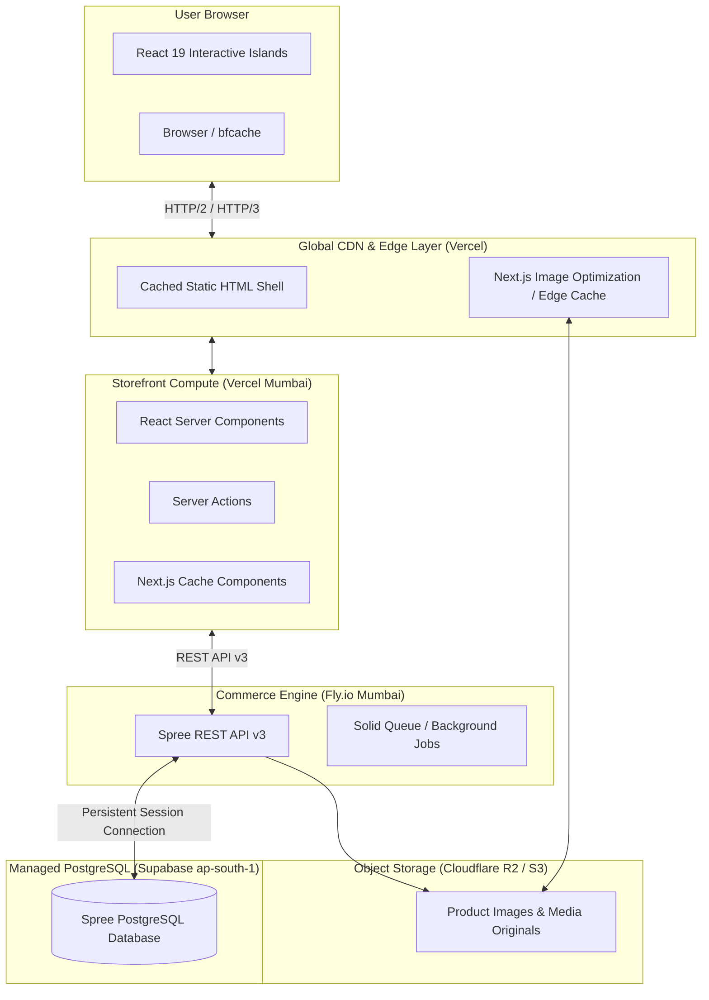

# Architecture & Delivery Topology

## 1. System Topology Overview

---

## 2. Core Rendering Principles

1. **Server Components by Default**:
   All page chrome, navigation, breadcrumbs, descriptions, technical specifications, and static media are rendered via Server Components. They do not ship hydration JavaScript to the client.
2. **Dynamic / Interactive Islands**:
   Only interactive components (Cart slider, Variant selector, Live availability badge, Wishlist button) use `"use client"` directives.
3. **Next.js Cache Components**:
   Enables Partial Prerendering (PPR) semantics. Slow dynamic information does not block the initial static shell and cached product information.
4. **Decoupled Architecture**:
   The storefront communicates solely through the Spree Store API v3 via `@spree/sdk`. Next.js does not directly connect to PostgreSQL.
