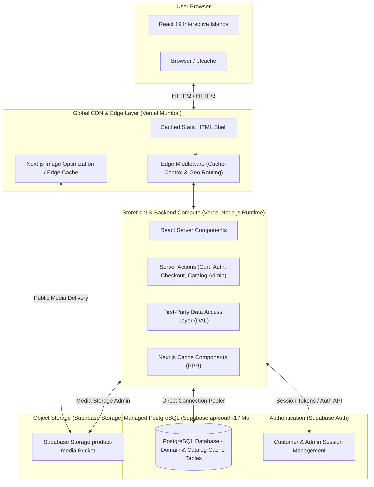

# Architecture & Delivery Topology

> **Scope.** This document describes *runtime topology only*. It does not carry
> phase or project state — see `docs/ENGINEERING-CONTINUITY-LOG.md` for that.
> It was reconciled with the codebase on **2026-09-14** (head `6c504be`).
>
> Phase at reconciliation: **backend migration B1–B10 complete**;
> **final UI implementation in progress**.

## 1. System Topology Overview



---

## 2. Architecture Tiers & Environments

To ensure benchmark integrity and avoid contaminated comparisons, this repository strictly distinguishes between architecture environments:

### Tier 1: Active Production Architecture (Current Live Baseline)
* **Storefront & Backend**: Next.js 16 (React 19) hosted on **Vercel** ([`mirzafootwear.vercel.app`](https://mirzafootwear.vercel.app)). Static shells and catalog routes are cached at edge nodes (Mumbai `bom1`). Direct first-party Server Actions and Data Access Layer.
* **Authentication**: **Supabase Auth** for customer and catalog admin authentication with secure HTTP-only session cookies.
* **Database**: Managed **Supabase PostgreSQL** in the `ap-south-1` (Mumbai) region. Direct pooled connection handling addresses, profiles, carts, orders, and bounded-query catalog read models.
* **Media**: Delivered via **Supabase Storage** `product-media` public bucket with Next.js Image Optimization edge caching.
* **Commerce Operations**: Zero runtime dependency on Ruby on Rails, Spree, Puma, or Render.

### Tier 2: Local Development Architecture
* **Storefront**: Local Next.js dev server (`http://localhost:3001`).
* **Backend**: First-party DAL communicating directly with PostgreSQL and Supabase services. Zero Docker or external Rails containers required.

### Tier 3: Alternative Comparison Architectures (Benchmarking Candidates)
* **Fly.io Mumbai (`bom`) Persistent Container**: An alternative persistent deployment target evaluated for low-latency sub-millisecond network hops to Supabase Mumbai.
* **Supabase Smart CDN / Direct Pre-Generated Storage**: Target architecture evaluated under Experiments 009–013 for eliminating runtime on-demand image transformation compute.

---

## 3. Core Rendering & Performance Principles

1. **Server Components by Default**:
   All page chrome, navigation, breadcrumbs, descriptions, technical specifications, and static media shells are rendered via React Server Components (RSC). They do not ship hydration JavaScript to the client.
2. **Dynamic / Interactive Islands**:
   Only interactive components (Cart drawer, Variant picker, Live availability badge, Wishlist controls) use `"use client"` directives.
3. **Centralized Cache Policy**:
   All route caching headers in `next.config.ts` and `middleware.ts` are strictly derived from the single canonical module `storefront/src/lib/cache/cache-policy.ts` to prevent edge cache drift.
4. **First-Party Data Access Layer**:
   The application communicates directly through a typed Data Access Layer (DAL) and React Server Actions to PostgreSQL and Supabase services. Zero runtime dependency on `@spree/sdk`, legacy BFF endpoints, or external Rails servers.

---

## 4. Route Groups & URL Structure

URL shape:

```text
/{country}/{locale}/...
```

Example: `/us/en/products`, `/us/en/c/office-wear`, `/us/en/products/shoe-2026-09-001`.

Supported locales: `de`, `en`, `es`, `fr`, `pl` (registry: `src/i18n/locales.ts`).

Route groups under `src/app/[country]/[locale]/`:

| Group | Purpose | Notes |
|---|---|---|
| `(storefront)` | Public catalog, PDP, cart, account, policies | Full header/footer layout |
| `(checkout)` | `checkout/[id]`, `order-placed/[id]` | Minimal layout |
| `(admin)` | `/admin` — products, variants, categories | Role-gated server-side |
| `(wholesale)` | `/wholesale` — gated B2B surface, quick order | Enabled by `WHOLESALE_CHANNEL` |

Plus `src/app/dev/emails/[template]` — a development-only email template
previewer (Resend + `react-email`).

---

## 5. Data Ownership

```text
auth            → Supabase Auth            (sole authority)
profiles        → PostgreSQL public.profiles
addresses       → PostgreSQL public.addresses
carts           → PostgreSQL public.carts / cart_items
orders          → PostgreSQL public.orders / order_items
catalog         → PostgreSQL public.products / variants / categories
                  + cached public read model (tag: catalog-public)
catalog admin   → first-party Next.js admin
media metadata  → PostgreSQL public.product_images
media bytes     → Supabase Storage `product-media`  (admin uploads)
                  …and static /catalog-shoes/*.webp  (current catalog; see §6)
```

Authorization is always:

```text
verified Supabase claims.sub → public.profiles → public.profiles.role
```

Never from email, signup metadata, client state, route visibility, or legacy tokens.

---

## 6. Catalog Read Path & Current Catalog Contract

```text
PostgreSQL source of truth
→ bounded 4-query snapshot   (lib/catalog/catalog-repository.ts)
→ Next cache tagged `catalog-public`
→ in-process filter / search / sort / lookup
→ compatibility DTOs → components
```

Performance contract (enforced by audit tests):

```text
warm snapshot DB queries = 0
cold snapshot DB queries = 4 (bounded)
N+1 = 0
PLP = 12 products initial + exactly one deferred remainder request
```

Current catalog contents:

```text
categories = 2   office-wear, traditional
products   = 31  shoe-2026-09-001 … shoe-2026-09-031
sizes      = 7 per product  (UK/India 6–12)
media      = /catalog-shoes/shoe-NN.webp
```

**Media Contract v1 Customer Cutover Complete (Phase 4).**
The customer-facing storefront reads directly from `public.product_media` and `public.media_assets`.
The 31 canonical shoes are served from their authoritative Supabase Storage stone masters
(`media/{assetId}/original.webp`) through `getStoragePublicUrl()`.
The legacy table `public.product_images` and static directory `storefront/public/catalog-shoes/`
are strictly preserved as rollback/transitional data. Legacy admin media mutation controls
in `ProductMediaManager` have been guarded with a migration warning while the global Media Library
and admin redesign are pending.

### 6.1 Media Contract v1 & Media Library Backend (Phases 1–5)
1. **Physical & Placement Decoupling**:
   - `public.media_assets`: Global reusable assets (`storage_provider`, `storage_path`, dimensions, dominant color, LQIP, `content_sha256`).
   - `public.product_media`: Product placement, gallery positioning (`position`), hero designation (`is_hero`), and contextual alt text (`alt_text`).
2. **Direct-to-Storage Ingestion**:
   - Client requests single-use signed URL via `requestMediaLibraryUploadAction`.
   - Client uploads image binary directly to Supabase Storage path `media/{assetId}/original.{ext}`.
   - Client invokes `finalizeMediaLibraryUploadAction`: Server downloads buffer, validates and decodes with Sharp (format, dimensions, dominant color, LQIP), computes SHA-256 integrity hash, and inserts idempotent record into `public.media_assets`.
3. **Placement & Deletion Safety**:
   - Products are attached via `attachMediaAssetToProductAction` without file duplication.
   - Asset deletion (`deleteMediaLibraryAssetAction`) enforces strict foreign-key protection: rejects deletion of assets currently attached to products (`usage_count > 0`), rejects deletion of legacy rollback assets, and performs DB deletion before Storage object cleanup.
4. **Cache Invalidation**:
   - All product media mutations invoke `updateTag("catalog-public")` to revalidate customer-facing Next.js PPR cache.

The retired 38-product demo catalog (`office-footwear-01`,
`traditional-footwear-NN`, categories `formal-office` / `traditional-indian`) is
gone. Any documentation or smoke test still referencing those identifiers is stale.

---

## 7. Environment Configuration

First-party variables (server-only unless prefixed):

```text
DATABASE_URL                              Secret
SUPABASE_DB_CA_CERT_BASE64                Secret — strict TLS, rejectUnauthorized: true
SUPABASE_SECRET_KEY                       Secret, server-only, never NEXT_PUBLIC_*
NEXT_PUBLIC_SUPABASE_URL
NEXT_PUBLIC_SUPABASE_PUBLISHABLE_KEY
WHOLESALE_CHANNEL                         optional; unset = DTC-only
```

Optional: `RESEND_API_KEY` / `EMAIL_FROM`, `SENTRY_DSN`, `GTM_ID`,
`NEXT_PUBLIC_SITE_URL`, `NEXT_PUBLIC_STORE_NAME`.

> The publishable key is `NEXT_PUBLIC_SUPABASE_PUBLISHABLE_KEY` (not
> `..._ANON_KEY`). All env examples were corrected on 2026-09-14.

Strict database TLS is a hard invariant. Do not regress to
`rejectUnauthorized: false`.

---

## 8. Validation Baseline

Measured on `feat/editorial-admin-catalog` (Phase 7), 2026-09-18:

```text
Vitest        76 suites / 855 tests passing (100% pass)
TypeScript    tsc --noEmit clean (0 errors)
Biome         lint clean (0 errors, 0 warnings across 365 files)
Next.js       Production build clean (103/103 static pages generated)
```

---

## 9. Media Contract Authority Status

Following Phase 6B:
- **Customer Storefront Media Authority**: Media Contract v1 (`public.product_media` + `public.media_assets`).
- **Admin Product Media Authority**: Media Contract v1 (`public.product_media` + `public.media_assets`).
- **Global Media Library Authority**: Media Contract v1 (`public.media_assets` direct signed uploads + Sharp processing).
- **Legacy `public.product_images` Status**: Retained exclusively for emergency rollback and historical migration reference. Active admin read/write dependency count: 0.

---

## 10. Mirza Admin Studio Control Plane (Phase 7)

The Mirza Admin Studio (`/(admin)/admin/*`) provides a unified, editorial control plane adhering to the brand's aesthetic language:

1. **Design Tokens & Typography**:
   - Shared CSS variables (`--admin-canvas`, `--admin-surface`, `--admin-secondary`, `--admin-stone`, `--admin-ink`, `--admin-muted`, `--admin-border`).
   - Fonts: `Playfair Display` (`--font-editorial-display`), `Newsreader` (`--font-editorial-text`), and `Geist` (`--font-geist`).
   - Replaced generic SaaS gray tables, shadow-sm, and bright pill badges with quiet typography, thin warm dividers, and flat surfaces.
2. **Data Access Models**:
   - **Overview (`/admin`)**: `getAdminCatalogOverview()` executes bounded metric queries and recent product delivery in exactly 2 SQL queries with Media Contract v1 hero resolution.
   - **Products Index (`/admin/products`)**: `listAdminProductsPage()` executes single bounded CTE pagination (default 30/page), supporting URL state (`?q=&status=&category=&sort=&page=`), aggregating variants and categories, and delivering Media Contract v1 heroes with 0 N+1 lookups.
   - **Product Edit (`/admin/products/[id]`)**: Integrates Radix dialog confirmations for archiving (no browser `confirm()`), unsaved form dirty tracking, accessible category checkboxes, compact variants editor, and preserved Media Contract v1 Product Media Manager.
   - **Categories (`/admin/categories`)**: Replaced browser `alert()`/`confirm()` with Radix Create/Edit Dialog and Safe Delete Dialog with server-validated product-count guards.
3. **Storefront Isolation**:
   - Customer-facing bundle impact = 0 bytes JS.
   - Zero customer catalog query changes or database schema migrations.

