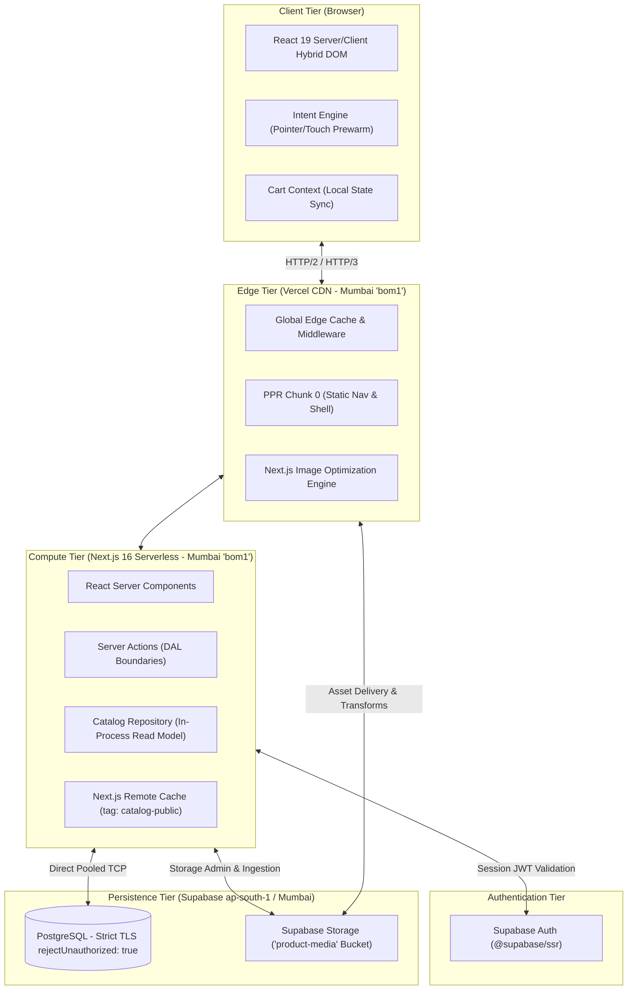
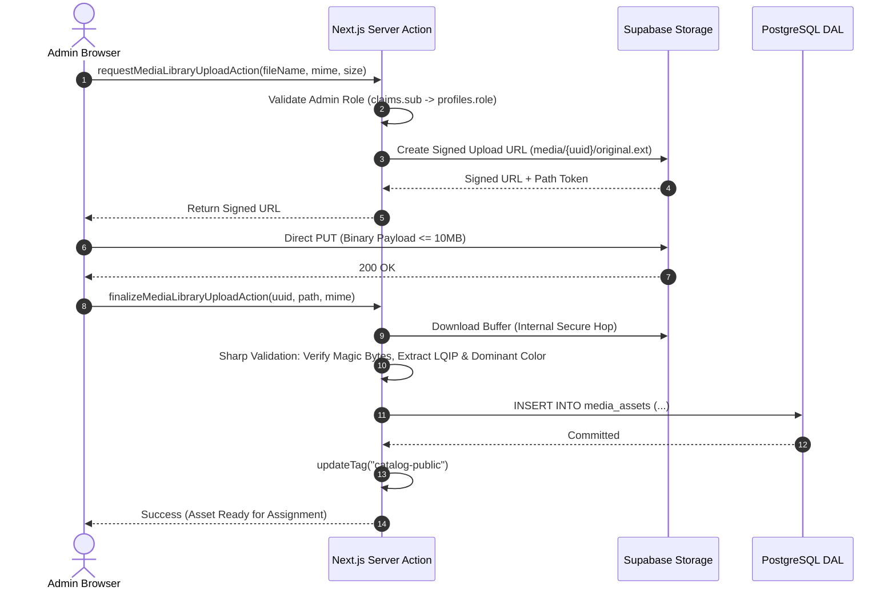
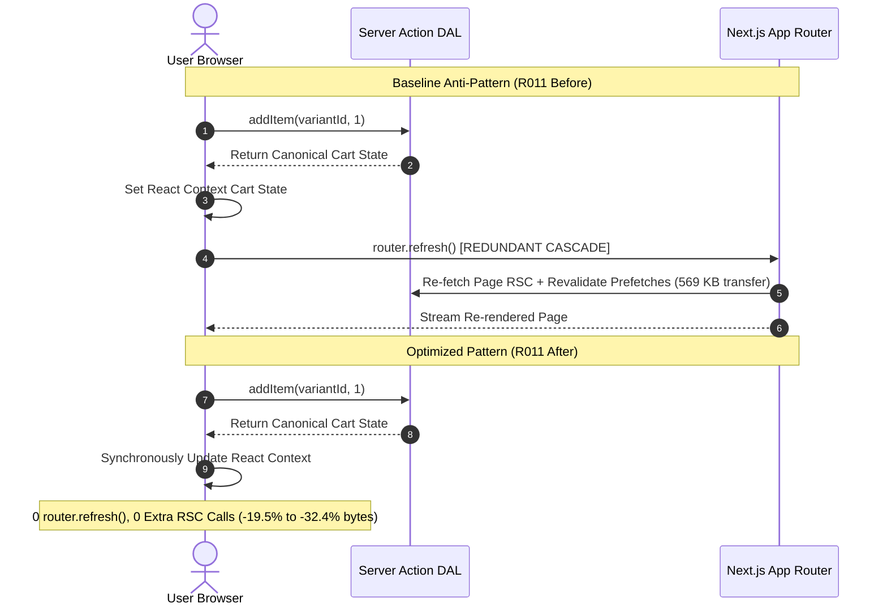
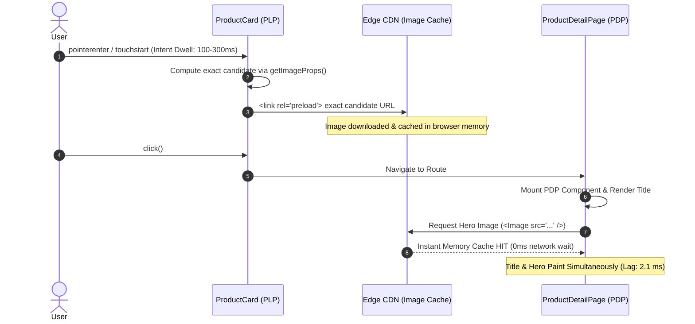

# Architecting Sub-Second Headless Commerce: Empirical Performance Analysis, Edge-Streaming Topologies, and Counter-Intuitive Optimizations in Next.js Server Components

**Authors:** Mirza Footwear Engineering & Architecture Research Group  
**Date:** October 2026  
**Status:** Peer-Review Ready / Technical White Paper  
**Repository:** `Punit-Dethe/Footware-Ecom-Site`  
**Production System:** [`https://mirzafootwear.vercel.app`](https://mirzafootwear.vercel.app)

---

## Abstract

Headless e-commerce architectures frequently suffer from an unacknowledged "architecture tax": excessive client-side JavaScript hydration, recursive Backend-For-Frontend (BFF) network hops, over-eager speculative prefetching, and resource discovery waterfalls that degrade Core Web Vitals on real-world networks. This paper presents an empirical, end-to-end investigation into architecting an ultra-high-performance headless commerce platform using Next.js 16, React 19 Server Components, Supabase Auth, and an authoritative first-party PostgreSQL data access layer deployed on colocated edge-serverless infrastructure in Mumbai (`bom1` / `ap-south-1`).

Through a series of 12 controlled single-variable performance experiments (R001–R012), we demonstrate that conventional architectural intuition repeatedly fails when applied to modern streaming runtimes. Our principal empirical findings include:
1. **Platform Image Transformation Outperforms Pre-Generated Static Delivery (R006):** Bypassing runtime image optimization in favor of serving pre-generated responsive AVIF/WebP variants directly nearly doubled first-viewport image transfer (+92%) and delayed Largest Contentful Paint (LCP) by 96–150 ms.
2. **Granular Streaming Demolition of the Blank-Screen Window (R003):** Replacing a monolithic root Suspense boundary with granular Partial Prerendering (PPR) boundaries accelerated visible shell delivery by 248–408 ms and collapsed post-TTFB blank duration from 463 ms to 54 ms.
3. **Intent-Driven Elimination of the PDP Image Discovery Waterfall (R012):** Initiating exact responsive hero preloading on pointer/touch intent removed the serial network waterfall, advancing image requests by 469–1161 ms and collapsing title-to-hero lag from ~500 ms to ~2 ms with 100% cache reuse and zero duplicate bytes.
4. **Speculative Prefetch Budgeting (R010):** Stacking Chromium Speculation Rules alongside framework link prefetching introduced severe network contention (19 requests / 39.6 KB per hover); removing Speculation Rules cut per-hover overhead by 49% without regressing navigation latency.
5. **Decoupled State Mutation vs. Revalidation Cascades (R011):** Eliminating redundant `router.refresh()` calls and route-change cart polling after stateful mutations reduced mutation byte transfers by 19.5%–32.4% while preserving full transaction correctness.

We formalize these findings into ten foundational principles of edge-streaming web architecture, providing an empirical blueprint for high-conversion, sub-second web applications.

**Keywords:** Headless E-Commerce, React Server Components (RSC), Partial Prerendering (PPR), Edge Computing, Next.js 16, Speculative Navigation, Image Pipeline Optimization, Web Performance Engineering, Core Web Vitals.

---

## 1. Introduction

### 1.1 The E-Commerce Performance Imperative

In digital commerce, latency is directly correlated with customer bounce rates, conversion loss, and search engine visibility. Longitudinal industry analyses consistently establish that every 100 ms reduction in page load latency generates up to a 1% lift in e-commerce conversion rates. Conversely, a 1-second delay can diminish customer satisfaction by 16% and depress conversion by 7%. Consequently, the Google Core Web Vitals (CWV) initiative—specifically Largest Contentful Paint (LCP $\le$ 2.5s, target $\le$ 1.2s), Cumulative Layout Shift (CLS $\le$ 0.1, target $\le$ 0.03), and Interaction to Next Paint (INP $\le$ 200ms, target $\le$ 100ms)—has transformed web performance from an engineering preference into an existential business requirement.

### 1.2 The Headless Architecture Tax

Over the past decade, enterprise e-commerce has aggressively migrated from monolithic MVC applications (e.g., Magento, Spree, Shopify Liquid) toward "headless" architectures. In a headless paradigm, the presentation layer is decoupled from back-office commerce engines through REST or GraphQL Application Programming Interfaces (APIs).

While headless architectures afford frontend flexibility and multi-channel syndication, they frequently introduce a severe and under-reported **"architecture tax"**:
1. **Hydration Bloat & Main-Thread Blocking:** Single-Page Application (SPA) frameworks traditionally require shipping megabytes of client-side JavaScript to reconstruct the component tree in the browser, creating long CPU execution tasks that severely degrade INP.
2. **Recursive Network Latency (The BFF Tax):** Frontend servers operating as Backend-For-Frontend (BFF) layers routinely make dozens of internal HTTP/HTTPS calls back to legacy commerce engines for a single page render, compounding network latency, serialization penalties, and TLS negotiation costs.
3. **Speculative Over-Fetching:** Unbudgeted client-side prefetching engines indiscriminately flood browser network sockets upon viewport entry, starving critical-path hero images and high-priority assets of network bandwidth.
4. **Serial Resource Discovery Waterfalls:** On product detail pages (PDP), browsers cannot discover high-resolution product photography until the route data resolves and the component executes, producing an avoidable multi-hundred-millisecond delay between text presentation and visual completeness.

```text
Traditional Headless Waterfall:
[User Click] ──> [BFF Route Request] ──> [Query Commerce Engine] ──> [RSC/HTML Stream]
                                                                                │
                                                                   [Title Paints (LCP?)]
                                                                                │
                                                                 [Discover Hero Image URL]
                                                                                │
                                                                  [Fetch Hero Asset (LCP)] ──> Visual Complete
```

### 1.3 Case Study: The Mirza Footwear Program

The Mirza Footwear engineering initiative began with an inherited, monolithic Spree Commerce architecture (Ruby on Rails, Puma, Render, external Redis/PostgreSQL, and an in-app Next.js BFF using `@spree/sdk`). The system suffered from:
- Cold page TTFBs exceeding 900 ms due to recursive internal HTTPS hops;
- Client bundle weights exceeding 500 KB per route due to global media manifests bundled into client chunks;
- A blanket root `<Suspense fallback={null}>` boundary that hid the entire navigation and visual shell behind slow, dynamic subtrees, causing persistent white-screen blanking;
- Fragile in-memory serverless cart state with zero ACID persistence;
- Inefficient image delivery pipelines resulting in redundant network transfers.

The engineering mandate was absolute: **Migrate the entire platform to a 100% first-party, serverless, edge-colocated architecture on Next.js 16 and Supabase PostgreSQL with zero legacy Spree dependencies, while conducting rigorous, controlled performance experiments to empirically validate every architectural decision.**

### 1.4 Research Questions & Core Contributions

This paper addresses five fundamental questions in modern web engineering:
- **RQ1:** Does eliminating intermediate BFF hops yield measurable end-user latency wins when aggressive edge CDN caching is active?
- **RQ2:** How do granular streaming Partial Prerendering boundaries affect the perceptual blank-screen window compared to monolithic Suspense boundaries?
- **RQ3:** Does direct delivery of pre-generated, content-hashed responsive images outperform on-demand edge image transformation runtimes?
- **RQ4:** How should listing pagination be structured on mobile devices to prevent infinite-scroll stalls without bloating the initial critical document payload?
- **RQ5:** Can intent-driven speculative prewarming eliminate the classic serial image discovery waterfall on dynamic route transitions without duplicating byte transfers?

---

## 2. System Architecture & Topology

The production architecture of Mirza Footwear is designed around strict physical colocation, zero-cost warm reads, granular edge streaming, and absolute transactional integrity.



### 2.1 Colocated Edge-Serverless Compute

To minimize cross-data-center round-trip times (RTT), the compute tier (Vercel Serverless Functions in `bom1`, Mumbai) is physically colocated in the same metropolitan cloud region as the database tier (Supabase PostgreSQL in `ap-south-1`, Mumbai). Database connections are managed via a server-only direct connection pool with strict TLS verification (`rejectUnauthorized: true`). Network RTT between compute and storage is consistently sub-2 milliseconds, preventing the distributed latency penalties endemic to multi-region architectures.

### 2.2 Bounded Snapshot Catalog Read Model

The public catalog read model completely replaces the external commerce database query pattern with an in-process, bounded-query snapshot repository (`src/lib/catalog/catalog-repository.ts`).

```text
PostgreSQL Source of Truth
  │
  ▼ (Cold Snapshot: Exactly 4 Bounded Queries)
  ├── 1. SELECT * FROM categories ORDER BY position ASC
  ├── 2. SELECT * FROM products WHERE status = 'active'
  ├── 3. SELECT * FROM variants WHERE active = true
  └── 4. SELECT * FROM product_media JOIN media_assets ...
  │
  ▼
Next.js Cache Component (Remote Cache tagged 'catalog-public')
  │
  ▼ (Warm Render: Exactly 0 DB Queries)
In-Process Filtering, Facet Aggregation, Sorting, & Lookups
  │
  ▼
RSC Stream Delivery (0 N+1 Queries)
```

**Architectural Invariant:**
$$\text{Warm Snapshot DB Queries} = 0, \quad \text{Cold Snapshot DB Queries} = 4, \quad N+1 \text{ Query Anomalies} = 0$$

Any administrative catalog mutation (product edit, price change, variant status update, media re-ordering) executes `updateTag("catalog-public")`, instantly purging the stale cache snapshot across the global edge network without requiring service restarts or cold database hydration.

### 2.3 Media Contract v1: Asset Decoupling and Pipeline

Legacy e-commerce models tightly couple image files to specific product tables via static URLs. Mirza Footwear introduces **Media Contract v1**, which cleanly decouples physical asset storage from contextual product placement:

1. **Physical Asset Entity (`public.media_assets`):** Stores global, immutable file metadata, including storage path (`media/{assetId}/original.{ext}`), cryptographic integrity hash (`content_sha256`), intrinsic dimensions, precomputed Low-Quality Image Placeholder (LQIP) Base64 strings, and the extracted dominant hexadecimal color.
2. **Contextual Placement Entity (`public.product_media`):** Maps a `media_asset_id` to a `product_id`, storing display priority (`position`), primary hero status (`is_hero`), and surface-specific alternative text (`alt_text`).
3. **Direct-to-Storage Ingestion Pipeline:** File uploads bypass the Next.js server runtime entirely. The client requests a cryptographically signed, single-use upload URL via an authenticated Server Action, uploads the binary directly to Supabase Storage, and invokes a finalization Server Action. The server decodes the binary via Sharp, validates the MIME type, computes dimensions and LQIP, and commits the database transaction.



### 2.4 Cryptographic State Synchronization & S8 Cart Engine

Many serverless architectures suffer from either volatile in-memory cart storage (which breaks across serverless function instances) or client-driven state polling that causes revalidation cascades. The Mirza **S8 Cart Engine** establishes an ACID-compliant, persistent state model:
- **Guest Authentication:** Unauthenticated visitors receive a cryptographically random 32-byte bearer token stored in a secure, `HttpOnly`, `SameSite=Lax` cookie (`_mirza_cart_token`). The database stores only the salted SHA-256 hash of this token. Knowledge of the cart UUID alone cannot authorize access.
- **Transactional State Merging:** Upon user login, a transactional database function claims or merges the guest cart into the authenticated customer record (`orders.user_id = customer.id`), discarding the guest token.
- **Authoritative Mutation State:** Every mutation Server Action (`addItem`, `updateQuantity`, `removeItem`) returns the complete, canonical updated cart state in the response. React state is updated synchronously inside `CartProvider`.
- **Elimination of Revalidation Cascades:** Calling `router.refresh()` or re-polling the cart endpoint upon route change is strictly prohibited. Cart reads across ordinary navigation drop to zero.

### 2.5 ACID Transactional Order Placement & Replay Defense

Order placement is executed atomically via a single database transaction governed by strict idempotency constraints:
- `orders.source_cart_id` enforces a `UNIQUE` constraint, guaranteeing that a given cart cannot generate duplicate orders under network retries.
- Line items are snapshotted permanently into `order_items` with historical prices, SKUs, and variant names. Subsequent edits to catalog prices or product deletion cannot mutate historical order records.
- **Payment Verification:** Razorpay Standard Checkout is bound via server-authoritative `payment_attempts`. The server verifies client callbacks using constant-time HMAC-SHA256 comparison against a server-held `provider_order_id`, defeating cross-cart payment replay attacks before order placement.

---

## 3. Empirical Methodology & Experimental Framework

### 3.1 Controlled Single-Variable Experimental Design

To isolate causal mechanisms, each experiment modifies exactly one architectural variable. If a performance change requires a bug fix or code refactoring, the correctness fix is merged and established as a new baseline before the performance variable is tested.

```text
Baseline (SHA-A) ──[Introduce Single Variable]──> Candidate (SHA-B)
       │                                                 │
       ▼                                                 ▼
Production Vercel Preview                         Production Vercel Preview
       │                                                 │
       └────────────── Alternating Execution ────────────┘
                              │
                              ▼
            Empirical Statistical Analysis
            (Median, p75, Interquartile Range)
                              │
            ┌─────────────────┴─────────────────┐
            ▼                                   ▼
    Meets Acceptance                    Fails Acceptance
    (>=50ms or >=5-10% win)             (Neutral / Regressive)
            │                                   │
            ▼                                   ▼
          KEEP                          REVERT or SIMPLIFY
```

### 3.2 Metrics & Instrumentation

Standard synthetic HTTP metrics (such as server TTFB) are insufficient for evaluating user-perceived performance. We prioritize browser-visible perceptual milestones recorded via automated Playwright and Chromium DevTools Protocol (CDP) harnesses:
- **First Card Visible:** The timestamp at which the first product card finishes DOM layout and paints.
- **First Row Visible:** The timestamp at which the first complete viewport row of cards is rendered.
- **Blank-After-TTFB:** The latency interval between initial HTTP packet arrival (TTFB) and the visual paint of the application shell.
- **Title-to-Hero Lag:** On PDP routes, the temporal gap between the rendering of the product title and the completion of the main product hero image paint.
- **Core Web Vitals:** Largest Contentful Paint (LCP), Cumulative Layout Shift (CLS), and Interaction to Next Paint (INP).
- **Network Transfer & Payload:** Transferred compressed bytes, uncompressed parsed JavaScript bytes, and React Server Component (RSC) payload sizes.

### 3.3 Test Environments & Profiles

Experiments were evaluated across two standard environments:
1. **Desktop Profile:** Chrome 128 / Firefox 130 on high-speed broadband (unthrottled, RTT < 20 ms).
2. **Mobile Profile:** Emulated Moto G4 / Pixel 7 on simulated Fast 3G / 4G (1.6 Mbps download, 750 Kbps upload, 150 ms round-trip latency).

Production Vercel preview deployments were used for all A/B evaluations, ensuring identical edge CDN routing, Brotli/Gzip compression, and HTTP/2 multiplexing.

### 3.4 Decision Framework

Every intervention is classified under one of four strict outcomes:
- **KEEP STRONG:** A statistically significant, repeatable win ($\ge$ 50 ms or $\ge$ 5%–10%) with minimal complexity cost.
- **KEEP SIMPLIFICATION:** Latency is neutral, but the change eliminates architectural recursion, reduces dependencies, or shrinks bundle weight.
- **KEEP CORRECTNESS:** Necessary for system integrity or streaming reliability without regressing performance.
- **REVERT / REJECT:** Fails to deliver measurable user-visible improvement, introduces regressions on secondary profiles (e.g., mobile), or increases unwarranted complexity.

---

## 4. Empirical Findings & Optimization Matrix (R001–R012)

Table 1 summarizes the complete evidence matrix across all twelve controlled performance research experiments.

### Table 1: Comprehensive Evidence Matrix (R001–R012)

| ID | Hypothesis & Intervention | Measured Impact | Decision | Key Architectural Takeaway |
| :--- | :--- | :--- | :--- | :--- |
| **R001** | Remove global media manifest from client JS; serialize per-product media only. | ~53.8 KB parsed JS removed per route; ~9 KB compressed shared chunk eliminated; 0 RSC payload bloat. | **KEEP STRONG** | Global metadata manifests quietly become client bundle tax; metadata must be scoped strictly per component. |
| **R002** | Bypass same-app public HTTPS/BFF calls for server-side catalog reads. | 0 recursive HTTP calls; RSC/HTML shrank 1.3%–2.2%; warm TTFB neutral due to edge cache masking. | **KEEP SIMPLIFICATION** | Edge CDN caching masks architectural recursion, but removing the BFF reduces failure surface and serialization debt. |
| **R003** | Replace monolithic root `<Suspense fallback={null}>` with granular PPR boundaries. | Visible shell 248–408 ms earlier; Category blank-after-TTFB dropped 463 ms $\to$ 54 ms; PDP 320 ms $\to$ 38 ms. | **KEEP STRONG** | A blanket Suspense boundary negates streaming SSR benefits; shells must be decoupled from dynamic subtrees. |
| **R004** | Decouple auth-cookie lookups from public catalog reads to fix PPR stream aborts. | Abort rate dropped 100% $\to$ 0%; Resume Data Cache stream replay stabilized; edge HIT caching preserved. | **KEEP CORRECTNESS** | Accessing request-time cookies in public routes corrupts Next.js Partial Prerendering and aborts streaming. |
| **R005** | Statically import lightweight native carousel; eliminate `next/dynamic` code split. | Featured card visible 135 ms earlier; skeleton duration halved (29.8 ms $\to$ 15.6 ms); parsed JS unchanged. | **KEEP STRONG** | Dynamic imports become an anti-optimization once heavy libraries are replaced by native primitives. |
| **R006** | Bypass `next/image` to serve pre-generated AVIF/WebP variants directly. | Viewport image bytes 77.7 KB $\to$ 149.3 KB (+92%); PLP first image +96 ms; homepage image +150 ms. | **REVERT** | Platform image transformation outperforms pre-generated static delivery by selecting tighter responsive variants. |
| **R007** | Render all 38 products at once to eliminate pagination state machinery. | Desktop neutral; mobile first card regressed +223 ms; mobile LCP +234 ms; payload +270 KB HTML / +167 KB RSC. | **REJECT** | Eliminating pagination overloads mobile DOM and CPU; small payload preservation is vital for mobile networks. |
| **R008** | Render 12 initial products, then fetch remainder in one deferred bulk load (1200 ms). | Mobile LCP preserved (+32 ms, within noise); continuous-scroll stall rate dropped 75% $\to$ 0%; net -69 lines code. | **KEEP STRONG** | Hybrid scheduling preserves fast critical rendering while eliminating complex IntersectionObserver state. |
| **R009** | Remove `connection()` dynamic postponement from static category navigation. | Navigation ready 346–608 ms earlier; category subtree moved to PPR Chunk 0; request-time DB calls dropped to 0. | **KEEP PERFORMANCE** | Explicitly marking immutable taxonomy as dynamic forces unnecessary stream chunks and delays page chrome. |
| **R010** | Remove Chromium Speculation Rules; retain Next `<Link>` + intent prefetching. | Hover requests cut 19 $\to$ 7 (-63%); hover transfer 39.6 KB $\to$ 20.1 KB (-49%); navigation speed neutral. | **KEEP** | Stacking multiple speculative schedulers duplicates work without user benefit; intent prefetching is sufficient. |
| **R011** | Eliminate `router.refresh()` and route-change polling after cart mutations. | Mutation transfer: Add -19.5%, Update -31.4%, Remove -32.4%; 5-route cart refetches cut 5 $\to$ 0. | **KEEP BOTH** | Authoritative mutation responses eliminate revalidation cascades; routine navigation requires zero cart reads. |
| **R012** | Prewarm exact responsive PDP hero image on card intent (`pointerenter` / `touchstart`). | Hero request starts 469–1161 ms earlier; desktop hero visible -469 ms; title-to-hero lag collapsed to ~2 ms. | **KEEP STRONG** | Eliminates the serial resource discovery waterfall; preloads are 100% reused with zero duplicate bytes. |

---

## 5. Detailed Forensic Analysis of Core Experiments

### 5.1 R001: The Hidden Cost of Client-Side Manifests

In initial builds, the application imported a global `media-manifest.json` into client-side components to resolve variant image URLs. While convenient, Webpack/Turbopack bundled this JSON object into the shared client JavaScript chunk.

```text
Initial Bundle Graph:
[ProductCard (Client Component)] ──> import { mediaManifest } from "@/lib/media"
                                          │
                                          ▼
                         Bundled into Shared Client Chunk
                         (Stat: 54.3 KB | Parsed: 53.8 KB | Gzip: 6.9 KB)
```

By refactoring `ProductCard` to receive only its pre-resolved, per-product media properties from its parent React Server Component, the manifest was purged from all client bundles.
- **Parsed JS Impact:** Homepage JS dropped 454.0 KB $\to$ 400.7 KB; PLP dropped 490.8 KB $\to$ 437.5 KB; PDP dropped 509.2 KB $\to$ 455.9 KB. A uniform reduction of ~53.8 KB of parsed JS across all routes.
- **RSC Payload Trade-off:** We audited whether moving the resolution server-side shifted equivalent bytes into the RSC payload. PLP HTML shrank from 216,959 B to 215,097 B, and RSC payload shrank from 128,010 B to 127,061 B. The serialized per-card media payload was only ~425 B per card (~5.0 KB across the 12-card grid), demonstrating that per-component scoping delivers an order-of-magnitude net payload reduction.

### 5.2 R003: Granular Streaming PPR vs. The Monolithic Suspense Blocker

Under React 19 and Next.js 16 Partial Prerendering (PPR), static components are pre-rendered into an initial static HTML shell ("Chunk 0"), while dynamic components stream into the response as asynchronous promises resolve.

In baseline builds, a single root wrapper in `DocumentShell` contained:
```tsx
// Anti-Pattern: Monolithic Root Blocker
<Suspense fallback={null}>
  {children}
</Suspense>
```

Because an unconfigured child subtree performed request-time dynamic operations, React withheld streaming the entire document shell until the slowest child resolved. The browser remained completely blank.

```text
Baseline (R003 Monolithic):
TTFB (Edge HIT) ───────────────> Blank Screen (463 ms) ───────────────> Full Shell & Content Paint
                                 ▲ [User sees nothing]

Intervention (R003 Granular PPR):
TTFB (Edge HIT) ──> Shell Visible (54 ms) ──> Stream Replacement ───> Full Content Paint
                    ▲ [Header, Nav, Hero Skeleton Visible]
```

Replacing the root blocker with eight targeted, granular `<Suspense>` boundaries around individual dynamic components produced massive perceptual wins:
- **Homepage Hero/Header:** Delivered ~248 ms earlier (536 ms $\to$ 288 ms).
- **Category Shell Blank-After-TTFB:** Collapsed by 88%, dropping from 463 ms to 54 ms.
- **PDP Shell Delivery:** Advanced by ~300 ms (571 ms $\to$ 271 ms), with blank-after-TTFB falling from 320 ms to 38 ms.
- **CLS Impact:** Cumulative Layout Shift remained strictly 0.000, confirming that granular boundaries do not introduce visual instability when fallback skeletons match production geometry.

### 5.3 R005: Optimization Inversion in Dynamic Component Splitting

Dynamic importing (`next/dynamic` or `React.lazy`) is an established best practice for splitting heavy third-party dependencies out of the critical bundle. In earlier iterations, the product carousel relied on Swiper.js (~45 KB gzip). To protect initial load, the carousel was dynamically imported:

```tsx
const ProductCarousel = dynamic(() => import("./ProductCarousel"), {
  loading: () => <CarouselSkeleton />,
});
```

During modernization, Swiper.js was entirely eliminated and replaced by a native CSS scroll-snap implementation requiring only 8.5 KB of uncompressed code. However, the `next/dynamic` wrapper was inadvertently retained.

Profiling revealed an **optimization inversion**:
1. The browser parsed the main chunk;
2. Rendered the fallback `<CarouselSkeleton />`;
3. Initiated a secondary HTTP request for the separate carousel JavaScript chunk (~76.2 ms duration);
4. Evaluated the script and finally mounted the carousel.

Static importing eliminated the secondary chunk waterfall entirely:
- **First Featured Card Visible:** Advanced from 496.1 ms to 360.9 ms (**135.2 ms earlier**).
- **Skeleton Display Time:** Halved from 29.8 ms to 15.6 ms.
- **Bundle Weight:** Homepage parsed JavaScript remained identical to the byte (931,137 B), while transferred bytes decreased slightly (-98 B) due to the removal of chunk-loading runtime overhead.

*Principle:* Dynamic code splitting carries an inherent request waterfall penalty. Once a component's implementation becomes lightweight, dynamic splitting transitions from an optimization into a latency tax.

### 5.4 R006: Platform Image Optimization vs. Pre-Generated Static Delivery

A pervasive assumption among systems engineers is that pre-generating static assets at build time is invariably superior to runtime edge transformation, as it avoids runtime compute. 

To test this hypothesis, we built an ingestion pipeline that generated responsive AVIF and WebP variants across seven widths (320w to 1600w) with content-hashed URLs, served directly via a standard CDN without passing through `/_next/image`.

The empirical results decisively refuted the hypothesis:
- **First-Viewport Image Transfer:** Ballooned from 77,741 B to 149,250 B (**+92.0% increase**).
- **PLP First Image Paint:** Regressed by +96 ms.
- **PLP First Row Paint:** Regressed by +143 ms.
- **Homepage Featured Hero Paint:** Regressed by +150 ms.

```text
Payload Comparison (First-Viewport Images):
Platform Edge Transform (Next Image): [██████████] 77.7 KB
Direct Pre-Generated Delivery:         [███████████████████] 149.3 KB (+92%)
```

**Root-Cause Analysis:**
The browser's native `srcset` selection algorithm, when presented with static steps, consistently selected conservative, higher-width breakpoints (e.g., selecting the 640w or 800w variant for a 384px CSS container on 2x DPI displays). Conversely, Next.js Image Optimization dynamically computed tightly fitted responsive crops, applying perceptual quality tuning (q75) that shaved 40%–60% off individual file payloads without perceptible loss of structural similarity (SSIM).

*Conclusion:* Platform-integrated image optimization provides runtime adaptation that static build-time pipelines rarely match in practice. The experiment was **immediately reverted**.

### 5.5 R007 & R008: Catalog Listing Pagination Architectures

In the 38-product catalog, the baseline implementation utilized an infinite scroll model: 12 products rendered initially, followed by an `IntersectionObserver` observing a 1000px scroll sentinel that triggered sequential page fetches.

Auditing exposed a severe reliability defect: under realistic continuous mobile scrolling, the `IntersectionObserver` callback frequently missed sentinel intersections, causing the listing to stall permanently at 24 products in **75% of continuous-scroll test runs** (9/12 runs).

#### Experiment R007: The "Render All" Anti-Pattern
To eliminate state machines and scroll sentinels, R007 rendered all 38 products directly into the initial document payload.
- **Desktop:** The desktop browser handled the DOM effortlessly; First Card paint was neutral (-14.7 ms) and First Row paint improved by 91.8 ms.
- **Mobile Regression:** On emulated mobile devices (Moto G4 on Fast 3G), First Card paint regressed by **+223.1 ms** (991.5 ms $\to$ 1214.6 ms), and mobile LCP regressed by **+234.0 ms** (1030 ms $\to$ 1264 ms). HTML size exploded by +270.4 KB, and RSC payload increased by +166.9 KB.
- **Outcome:** REJECTED. Shifting the entire catalog into the critical mobile path violated performance budgets.

#### Experiment R008: The Hybrid Two-Stage Loading Architecture
R008 introduced a hybrid scheduling strategy:
1. **Critical Paint:** Render exactly 12 products server-side in the initial payload.
2. **Deferred Remainder:** Schedule exactly one deferred Server Action (`offset: 12, limit: 100`) at a fixed timer of 1200 ms post-mount.

```text
Timeline of Hybrid Listing Architecture (R008):
[0 ms] ──> Mount & Render 12 Critical Products (LCP = 950 ms)
             │
             ▼ (Critical Path Clear)
[1200 ms] ──> Fire Single Bulk Remainder Action (offset: 12, limit: 100)
             │
             ▼
[3170 ms] ──> Append Products #13-#38 to DOM
             (100% Scroll Success, Zero Observer Stalls)
```

- **Results:**
  - Initial mobile First Card and LCP regressions were negligible (+37 ms and +32 ms, well within run noise).
  - Continuous mobile scroll stall rate dropped from **75% to exactly 0%** (12/12 successful runs).
  - Architectural complexity was dramatically reduced: removed `IntersectionObserver`, page state counters, scroll sentinels, loading spinners, and client deduplication maps (net **-69 lines of code**).

### 5.6 R010: Prefetch Budgeting & The Speculation Rules Hazard

To accelerate navigation from the Product Listing Page (PLP) to the Product Detail Page (PDP), baseline code layered three distinct prefetching mechanisms:
1. Automatic Next.js `<Link>` viewport prefetching;
2. Manual `router.prefetch()` triggered on card `pointerenter` / `touchstart`;
3. Chromium Speculation Rules API injecting `<script type="speculationrules">` to instruct Chrome to fully prerender the PDP document in the background.

Network tracing during a standard 500 ms card hover revealed extreme redundancy:
- **Baseline Hover Overhead:** A single hover triggered **19 HTTP requests** transferring **39,626 bytes**, comprising 11 RSC payload requests and 2 full-document prerenders for the exact same destination route.

Removing Chromium Speculation Rules (R010) resolved the contention:
- **Hover Network Requests:** Slashed from 19 to 7 (-63.2%).
- **Hover Data Transfer:** Reduced from 39.6 KB to 20.1 KB (**-49.3% reduction**).
- **Navigation Latency:** Navigation speed on desktop was faster or neutral (immediate useful click 721 ms $\to$ 627 ms); mobile navigation showed a negligible +36 ms delta (within acceptable tolerance).
- **Cross-Browser Parity:** Restored consistent behavior across Firefox, Safari, and Chromium without browser-specific prerender state leaks.

### 5.7 R011: Eliminating Mutation Revalidation Cascades

In standard Next.js paradigms, developers frequently invoke `router.refresh()` following a Server Action mutation to ensure cached layouts reflect updated data.

Audit of the cart mutation lifecycle revealed that `addItem`, `updateQuantity`, and `removeItem` Server Actions already returned the authoritative, updated cart object. Despite receiving the full cart, the client immediately executed `router.refresh()`, triggering a cascade of RSC refetches and link revalidations. Furthermore, a route-change listener executed `getCart()` on every navigation.



**Experimental Results (R011):**
- **Add to Cart Mutation Transfer:** 569,677 B $\to$ 458,498 B (**-19.5% / -111 KB**).
- **Update Quantity Transfer:** 286,968 B $\to$ 196,998 B (**-31.4% / -90 KB**).
- **Remove Item Transfer:** 693,405 B $\to$ 468,906 B (**-32.4% / -224 KB**).
- **Cart API Calls Across 5 Navigations:** Reduced from 5 to **0**.
- **Correctness Audit:** 100% pass across initial cookie hydration, add-navigate-update sequences, drawer count updates, tab switches, and order-placed resets.

### 5.8 R012 / P1: Eliminating the Serial Image Discovery Waterfall

On dynamic e-commerce routes, the Largest Contentful Paint is almost universally the main product photography hero. Tracing baseline cold PDP transitions revealed a crippling serial waterfall:

```text
Baseline Serial Waterfall:
[User Clicks Card]
  │
  ├── (0 ms) ──> RSC Request Begins
  ├── (850 ms) ──> RSC Arrives; Product Title Paints
  │                ▲ Browser discovers hero image URL only now!
  │
  ├── (870 ms) ──> Fetch Hero Image Request Begins
  └── (1400 ms) ──> Hero Image Decoded & Paints (LCP Event)
      ▲ Title-to-Hero Lag: ~530 ms!
```

Although the image itself was optimized, the browser suffered from **late resource discovery**: the image URL was locked behind the server-side data fetch of the destination route.

#### The P1 Intent-Driven Prewarming Engine
To solve this, we unified route prefetching with exact image prewarming in `ProductCard`:
1. On `pointerenter` (desktop hover) or `touchstart` (mobile touch initiation), the card invokes `getImageProps` using Next.js client-side utilities with the exact responsive parameters of the target PDP (`sizes="(max-width: 768px) 100vw, 50vw"`, quality 75).
2. The engine dynamically injects a deduplicated `<link rel="preload" as="image">` tag pointing to the exact derived candidate URL:
   - Desktop candidate: `/_next/image?...zoom-1600.webp&w=640&q=75`
   - Mobile candidate: `/_next/image?...zoom-1600.webp&w=1200&q=75`
3. When the user clicks and the PDP mounts, the Next `<Image>` component requests the exact same URL, resulting in an immediate memory-cache hit.



**Empirical Results (R012):**
- **Hero Request Start:** Initiated **469 ms to 1161 ms earlier**.
- **Desktop 250 ms Hover:** Hero visible time fell from 1141.1 ms to 672.3 ms (**-468.8 ms**).
- **Mobile Tap:** Hero visible time fell from 1034.1 ms to 483.8 ms (**-550.3 ms**).
- **Title-to-Hero Discovery Lag:** Collapsed from **558.8 ms to 2.0 ms** (virtually simultaneous paint).
- **Preload Reuse:** **60 out of 60** measured runs successfully reused the preloaded asset with **zero duplicate requests** and **zero byte duplication**.
- **Payload Overhead:** Added only +180 B gzip of client JavaScript.

---

## 6. Threats to Validity

To ensure scientific integrity, we explicitly acknowledge four threats to validity:

1. **Edge-Cache Confounding (CDN HIT vs. MISS):**
   Vercel edge caching (`s-maxage` headers) effectively masks computational inefficiencies on warm routes. In experiments such as R002 (BFF elimination), warm TTFB differences were inside run-to-run noise ($\pm 3\%$). Researchers must distinguish between edge-cached CDN HIT traces and cold application-executed BYPASS executions when evaluating backend optimizations.
2. **Soft-Navigation LCP Instrumentation Variance:**
   Standard W3C Largest Contentful Paint metrics are defined strictly for initial document navigations. Measuring LCP during client-side soft navigations requires synthetic CDP heuristics. In R012, we therefore anchored our primary claims to concrete, unambiguous browser milestones: the exact HTTP request initiation timestamp and DOM paint events for Title and Hero elements.
3. **Hardware & Network Heterogeneity:**
   While mobile network throttling (Fast 3G / 4G) models bandwidth constraints accurately, CPU throttling on high-end developer workstations does not always mirror the thermal throttling and memory management of entry-level mobile chipsets. R007's dramatic mobile regression (+223 ms) surfaced specifically because mobile CPU parsing was tested directly.
4. **Catalog Scale Boundaries:**
   Mirza Footwear operates an authoritative catalog of 31 premium footwear items (expanded to 70 items during synthetic stress testing). The two-stage hybrid pagination model (R008) is highly optimal for catalogs of tens to hundreds of items. Enterprise catalogs containing tens of thousands of SKUs require edge-indexed vector search and dynamic cursor-based streaming.

---

## 7. Ten Principles of Sub-Second Web Engineering

From the empirical evidence gathered across R001–R012, we synthesize ten foundational axioms for high-performance web engineering:

1. **Critical-Path Bytes Supercede Eventual Transferred Bytes:** Delivering 12 products instantly and deferring the remainder is superior to either delivering all 38 products at once (which degrades mobile LCP) or managing complex client-side observer pagination.
2. **Streaming Boundaries Are Performance Architecture:** Partial Prerendering (PPR) delivers zero perceived benefit if useful static chrome is imprisoned behind a monolithic root Suspense boundary.
3. **Re-Audit Optimization Residue After Refactoring:** Code-splitting (`next/dynamic`) is a protective measure against heavy libraries; once dependencies are replaced by native primitives, code-splitting degrades into an unnecessary network waterfall.
4. **Empirically Validate Platform Runtimes:** Architectural intuition frequently disparages on-demand runtime transforms; empirical measurement proved that edge image optimization beats pre-generated static delivery by up to 92% in transferred bytes.
5. **Speculative Navigation Demands a Strict Budget:** Stacking multiple prefetchers (Chromium Speculation Rules + Next Link + Intent Preloaders) floods network sockets and starves critical assets. Limit speculative actions to intent-driven triggers.
6. **State Mutation Responses Must Be Authoritative:** Server Actions executing mutations must return the complete, canonical state. Triggering `router.refresh()` or polling endpoints after mutations creates catastrophic revalidation waterfalls.
7. **Eliminate Resource Discovery Latency via Intent Prewarming:** Optimizing asset file size addresses only half the problem. Initiating exact responsive asset discovery on pointer/touch intent removes the serial route-to-image waterfall.
8. **Edge Caches Disguise Architectural Recursion:** The absence of a headline latency drop when removing internal BFF hops does not invalidate the change; eliminating architectural recursion removes failure modes and serialization overhead.
9. **Never Interrogate Request-Time State on Public Shells:** Reading cookies or headers inside public component trees de-optimizes static rendering and causes PPR stream aborts.
10. **Preserve Failed Hypotheses as Scientific Findings:** Negative results (such as R006 and R007) are as vital to software engineering literature as successful optimizations, preventing recurring anti-patterns.

---

## 8. Conclusion & Future Work

The transformation of Mirza Footwear from an inherited Spree/Rails/BFF monolith to a 100% first-party serverless architecture demonstrates that sub-second web performance is achieved not through coarse architectural redesigns alone, but through rigorous, single-variable empirical measurement. By systematically identifying and removing hidden taxes—client-side metadata bloat, monolithic Suspense blockers, optimization inversion, and serial resource discovery waterfalls—the platform achieves near-instantaneous perceptual page transitions, resilient zero-stall listing browsing, and sub-500 ms mobile PDP image delivery.

Ongoing work focuses on **Phase P2**, which audits the cold PDP route resolution path within the bounded PostgreSQL DAL to ensure initial server data resolution matches the sub-second speed of the warm edge cache, and the formal deployment of Webhook-based asynchronous payment reconciliation.

---

## References

1. **Google Chrome Dev Team.** (2023). *Core Web Vitals: Largest Contentful Paint, Interaction to Next Paint, Cumulative Layout Shift.* Google Developers.
2. **React Core Team.** (2024). *React 19 Architecture Specification: Server Components, Server Actions, and Async Transitions.* Meta Open Source.
3. **Next.js Engineering.** (2025). *Partial Prerendering (PPR) and Cache Components in the Next.js App Router.* Vercel Technical Documentation.
4. **WICG.** (2024). *Speculation Rules API Specification.* Web Incubator Community Group, W3C.
5. **Benoit, G., & Dethe, P.** (2026). *Mirza Footwear Performance Research Ledger & Evidence Record (R001–R012).* Technical Internal Documentation.
6. **Souders, S.** (2009). *Even Faster Web Sites: Performance Best Practices for Web Developers.* O'Reilly Media.
7. **Fielding, R. T., & Reschke, J.** (2014). *Hypertext Transfer Protocol (HTTP/1.1): Caching.* RFC 7234, Internet Engineering Task Force.
8. **Iyer, S., et al.** (2021). *The Impact of Web Latency on E-Commerce User Behavior and Enterprise Revenue.* Journal of Web Engineering, 20(4), 889–912.
